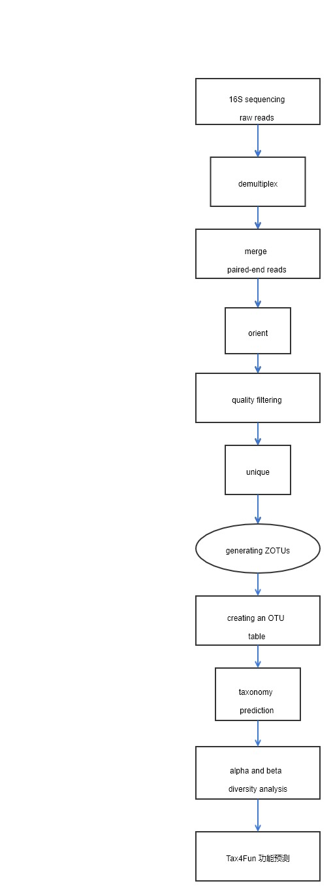

[TOC]

# 微生物16S数据流程文档

本文档定义16S数据类型介绍，输入数据及格式，输出结果及格式，公司目前使用的分析方法及步骤，质量控制标准及说明（待更新）。

#### 1 背景介绍：

##### 1.1 16S测序含义及实验处理简介

核糖体：Ribosome，由 RNA(rRNA）和蛋白质组成，配合 tRNA 来翻译 mRNA，生成肽链。核糖体按沉降系数来分类，S就是沉降系数，原核生物70S，真核生物80S。微生物的核糖体为70S，16S 就是指核糖体的亚基的一个组分，16S rRNA是指原核生物核糖体的一个组分。16S rRNA gene 是细菌chromosome上编码16S rRNA的基因，16S测序测得是16S rRNA基因的碱基序列。16S rRNA基因的进化具有良好的时钟性质，在结构与功能上具有高度的保守性，在大多数原核生物中16S rRNA基因都具有多个拷贝。16S rRNA基因由于大小适中，约1.5Kb左右，既能体现不同菌属之间的差异，又能利用测序技术较容易地得到其序列，故被细菌学家和分类学家广泛使用。16S rRNA 基因长度约1542bp，包括9个可变区和10个保守区，保守区序列反映了物种间的亲缘关系，而可变区序列则能反映物种间的差异，故成为细菌系统发育和分类鉴定最常用的标签。16S测序是指选择16S rDNA某个或某几个变异区域，选择通用引物对环境样本（肠道、土壤、水体等）微生物进行PCR扩增，然后对PCR产物进行高通量测序，并将得到的测序数据与已有的16S rDNA数据库进行比对分析，从而对环境群落多样性进行研究，核心是物种分析，包括微生物的种类，不同种类间的相对丰度，不同分组间的物种差异以及系统进化等。

公司的微生物16S数据使用341F ( 5 ’ -CCTACGGGNGGCWGCAG-3 ’ )和 805R (5’-GACTACHVGGGTATCTAATCC-3’) primer pair 扩增16S rRNA gene v3-v4区段，构建460bp左右的16S amplicon library，连接上spacer和barcode，形成480bp左右的待测DNA sequences。在ILLUMINA Miseq 平台，采用2*300bp, paired-end, dual-index 测序策略测序得到。

##### 1.2 输入数据及格式

流程的输入数据为一个批次的下机数据，一个批次的下机数据包含多个sample的16S测序数据，也就是来自多个微生物群落的16S测序数据，由一个multiplexed形式的forward Fastq 文件，一个multiplexed形式的reverse  Fastq 文件和一个记录barcode 信息sample_barcode.list文件组成。Fastq 文件中reads construct 为barcode+spacer+primer+amplicon。

##### 1.3 输出结果及格式

###### 1.3.1 分析结果内容：

该批次数据中含有的OTU（operational taxonomic unit）序列，每个OTU在七个分类学水平（kingdom-phylum-class-order-family-genus-species）的注释情况，每个OTU在不同sample的丰度，每个sample 的微生物群落组成microbial community composition，使用Tax4Fun得到的功能基因预测结果。然后将整批数据的结果拆分成每个sample对应的结果。主要为每个sample在不同分类学水平含有的分类单元及丰度。例如：某sample在属水平含有的属的名称及其丰度。每个sample含有的功能基因和代谢通路的ID编号和丰度。

###### 1.3.2 标准格式需要包含的内容：

1. 检测对象：包含原始检测对象编号(origID)，原始检测名称(origName)，碳云检测本体编号(ICX)。其中获得原始检测对象编号与碳云检测本体编号的映射关系的工作尚未完成，正在进行中。16S的物种注释结果用silva ID, taxonomy名称和碳云检测本体编号ICX:ID 来定义; 功能预测结果用KEGG中定义的KO 和pathway ID来定义。
2. 检测质量: 此处展示该检测的质量整体评估,比如merge步骤的merge成功比例，merge后reads长度的分布等。
3. 检测细节：此处包含检测获得的各种细节信息(Inf)。例如每一步处理所用命令的参数设置值和log日志。
4. 检测结果(Result)：此处包含检测的核心结果。如微生物和功能的种类及其丰度等指标。
5. 检测结果来源(Source)：如  lane, library, platform,date 等信息。

最终输出为QDF（quantitive detection format）格式文件和AQDF（annotated quantitive detection format）格式文件。

#### 2 分析步骤：

##### 2.1 Demultiplex, Assign reads to samples using barcodes : 

每个sample拥有不同的barcode pair，来自某一sample的所有的reads的前端碱基序列都相同且与此sample的barcode 序列匹配，根据此原理将multiplexed 文件中的reads assign到96个sample中。同时去除reads中的barcode，primer片段。

##### 2.2 Merge pairs，Merge paired reads to get consensus sequences and Q scores：

采用paired-end sequencing ，一个460bp的amplicon 会产生300 bp forward read和300 bp reverse read，根据overlap 区域将 forward read和reverse read merge，生成460bp merged read。并统计整批数据的 merged read 长度，Q值平均值，导致merge失败的不同原因的比例等等。

##### 2.3 Orient, since we have reads on both strands，orient before trimming and finding uniques :

将该批数据所有reads 和数据库比对，发现约一半reads比对上reference sequence的正链，约一半reads比对上reference sequence的负链，此步骤将所有reads orient至与数据库中reference sequence的正链一致。

##### 2.4 Quality filtering，Making OTUs (but not the OTU table) needs high-quality reads :

去除低质量的reads，保留高质量的reads用于聚类生成OTU，因为低质量的reads中含有较多测序引入的碱基错误，这些低质量的reads会增加spurious OTU的产生。

##### 2.5 Dereplication，Identify unique sequences and abundances；Discard singletons，Remove low-abundance reads, which often have errors：

将所有reads进行比对，找到unique sequence并统计每个unique sequence含有的reads数目，并去除掉只含有一条read的unique sequence，因为这样的unique sequence通常是扩增或者测序过程引入碱基错误产生的。

##### 2.6 Generating ZOTUs：

使用unoise3 command（UNOISE算法）对unique序列进行聚类，生成 ZOTUs。

##### 2.6.1 16S rRNA gene 多样性原理：

-  细菌的chromosomes 中通常含有多个拷贝的16S gene，这样的16S gene称为Paralogs 。Paralogs 之间通常也会存在小的碱基序列差异
-  同一species下也有不同的菌株strains，例如 E. coli，不同菌株之间的16S gene通常也会存在差异。同时，不同的菌株往往在表型上也存在重要的区别，比如致病性与否。
-  最后，不同species的细菌的16S rRNA gene 也会存在差异。

以上三个水平的16S gene差异造成了16S rRNA gene 的多样性。

##### 2.6.2 ZOTU相对于传统聚类方法产生的OTU的优势：

在USEARCH软件中，OTU被定义为那些正确的有生物学意义的序列correct biological sequences，此步骤的算法用于找出这些OTU（包含ZOTU和传统聚类方法产生的OTU）

- 传统聚类方法产生的OTUs，使用UPARSE算法生成

  UPARSE-OTU算法（cluster_otus命令）理论上将会报告正确生物序列的子集，使得（a）所有OTU彼此间<97％相同，并且（b） OTU序列是其unique sequence cluster中丰度最高的。此类OTU可以解释为Sneath-Sokal OTU，提供近似物种含义的可操作的分类学单元。

- Denoised OTUs (ZOTUs)

  UNOISE算法（unoise3命令）理论上将会报告reads中所有正确的生物序列。这些被称为zero-radius OTUs或ZOTU。由于种内变异（paralogs 旁系同源物之间的差异和菌株之间的差异），预计一些物种species可能会被分成几个ZOTU。 ZOTU的优势在于它们能够区分出具有不同表型的亲缘菌株，这些具有不同表型的亲缘菌株将被传统聚类方法根据97％相似性聚类到同一个OTU中。

reference: USEARCH documentation，Defining and interpreting OTUs

如果UPARSE算法顺利运行，将会得到reads中含有的正确的生物序列的一个子集，不同OTU序列之间彼此相似性< 97％（通常认为一个物种可能生成有一个以上的ZOTU，按照传统97％聚类方法生成的OTU可能含有一个以上的物种)。在cluster_otus命令中实现。

如果UNOISE算法顺利运作，将会报告出reads中所有正确的生物序列。 在unoise3命令中实现。
传统97％聚类方法产生的OTU主要缺点是丢弃了reads中存在的一些正确的生物序列。
reference: FAQ: Should you use UPARSE or UNOISE?

##### 2.7 Creating an OTU table：

将2.3步骤后得到的所有reads与上一步骤生成的ZOTU比对，若某read与某ZOTU间的碱基序列差异小于3%，则此read被归属到此ZOTU中，所有reads比对完之后进行统计，得到OTU table，记录每个sample 中每个OTU 的count/frequency。

| SAMPLE ID | SAMPLE 1 | SAMPLE 2 | SAMPLE 3 |
| --------- | -------- | -------- | -------- |
| ZOTU ID   |          |          |          |
| ZOTU 1    | count    | count    | count    |
| ZOTU 2    | count    | count    | count    |
| ZOTU 3    | count    | count    | count    |

##### 2.8 taxonomy prediction

将ZOTU与reference database中已经注释好的序列比对，确定每个ZOTU在个分类学水平下的名称，并统计每个sample在不同分类学水平含有的分类单元及丰度。

##### 2.9 alpha and beta  Diversity analysis

根据OTU table计算每个sample的shannon_e index，生成beta 多样性矩阵。

Beta多样性用于不同生态系统（这里为微生物群落）之间多样性的比较，利用各样本序列间的进化关系及丰度信息来计算样本间距离，反映样本（组）间是否具有显著的微生物群落差异。目前应用比较多的是PCA、PCoA、NMDS分析等。由于微生物多样性研究通常会涉及到大样本数量的样本，因此通过Beta-diversity分析可以直观地反映样本组间的差异情况。距离越远，微生物群落差异越大，即相似性越低。

##### 2.10 Tax4Fun 功能预测

使用R 包Tax4Fun预测该批数据含有的KO 和pathway的种类及丰度值。

​    

图1 16S分析流程图

