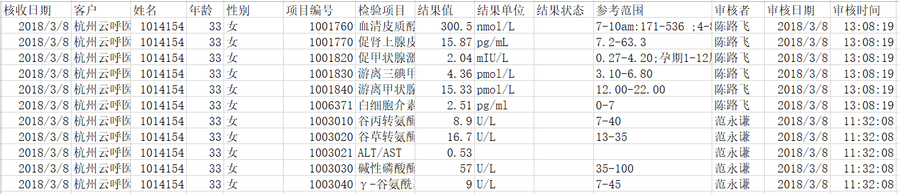
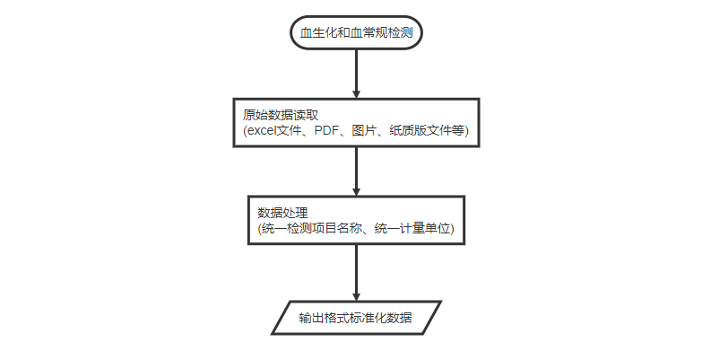

[TOC]

# 1 背景介绍

此项检测报告包含来自不同检测机构的血常规和血生化检测结果，由于检测时间和检测手段的不同，导致同一检测项的英文名称、中文名称、计量单位、正常值参考值等信息均不统一。

- 血常规

血常规是观察血细胞的数量变化及形态分布；血常规检查包括有红细胞、血红蛋白、白细胞、血小板等。

- 血生化

血生化是检测存在于血液中的各种离子、糖类、脂类、蛋白质及各种酶、激素和机体多种代谢产物的含量。

# 2 输入数据及格式

- 原始检测报告存放位置（有待确定）

- 原始文件包括机构后台反馈的excel文件，还包括用户提供的PDF、图片、纸质版等文件，其中excel文件的格式如下（不同机构的文件略微有差异）：

- 一个文件对应一个人的检测结果
- 建议在文件名中配置PID和检测机构？

# 3 数据处理

> 目的：

批量自动化读取原始检测数据，获取部分字段以供下游进一步分析

> 方法：

将同一检测项的英文名称、中文名称、计量单位进行统一处理，从原始检测报告中抽取部分有效字段

## 3.1 统一检测项名称

目前，整理了5家检测机构包括

- 广州金域
- 上海金域
- 北京艾迪康
- 上海艾迪康
- 北京海航
- 用户独自在医院的检测

共有121个检测项统一了英文名称和中文名称，检测项名称统一表见附件一，其各列依次是检测项ID、中文名称、别名、不同检测机构的正常值参考范围，如表一所示：

 表一 检测项名称统一表

| ID        | Name            | alias                                                   |
| --------- | --------------- | ------------------------------------------------------- |
| 25OHD3    | 25-羟基维生素D3 | 25-羟基维生素D3;25OHD3;                                 |
| A_G_ratio | 白蛋白/球蛋白   | 白蛋白/球蛋白(A/G);白/球;白/球蛋白比;A/G;白蛋白/球蛋白; |

## 3.2 统一计量单位

统计每个检测项使用的计量单位，选取使用频率较高的作为统一的计量单位，例如：

- 科学计数法表示方法的转换，如“10^9/l”和 “*10^9/l”均用“10e9/l”表示
- 单位表示规范化，如“umol/l" 转换为”μmol/l"
- 单位换算，如mmol/l = 1000 * μmol/l

检测项计量单位统一表详见附件二，其各列依次为检测项ID、统一的计量单位、使用的计量单位集合，部分内容如表二所示：

表二  检测项计量单位统一表

| ID   | measure unit | other measure unit |
| ---- | ------------ | ------------------ |
| DBIL | μmol/l       | umol/l             |
| LYMc | 10e9/l       | *10^9/l ;10^9/l    |
| FRUC | μmol/l       | mol/l;mmol/l       |

## 3.3 统一提取字段名称

目前，从原始报告中提取6个重要字段信息，包括项目名称、项目测定值、参考范围、单位、临床诊断和样本类型，这6个字段在不同的检测报告中具有不同的表示方法，提取字段名称统一表详见附件三，其各列依次是字段、字段其他表示法、搜索关键字，部分内容如表三所示：

| field_name | other_field_name                                             |
| ---------- | ------------------------------------------------------------ |
| 项目名称   | 项目名称;金域项目名称;项目简称;检验项目;检测项目;金域名称;项目;项目明细简称 |
| 项目测定值 | 项目测定值;结果值;结果                                       |
| 参考范围   | 参考范围;参考值                                              |
| 单位       | 单位;结果单位                                                |
| 临床诊断   | 临床诊断;临床意义;建议与解释                                 |
| 样本类型   | 样本类型;标本类型;标本种类;标本名称                          |

## 3.4 数据提取

根据统一的提取字段名称，提取相应信息，并对检测项名称和计量单位进行统一化处理，其流程如图一所示。

                                                               图一 血生化和血常规检测报告处理流程图

# 3 输出数据及格式

输出文件含有7列数据，依次是：

- 项目名称，即检测项ID
- 项目名称解释
- 项目测定值
- 参考范围
- 单位
- 临床诊断
- 样本类型

后续可补充以下信息：

- 检测机构

- 性别
- 检测时间

# 附件

附件一：[检测项名称统一表](./files/uniform_name.txt)

附件二：[检测项计量单位统一表](./files/uniform_measure_unit.xlsx)

附件三：[提取字段名称统一表](./files/uniform_field_name.xlsx)

