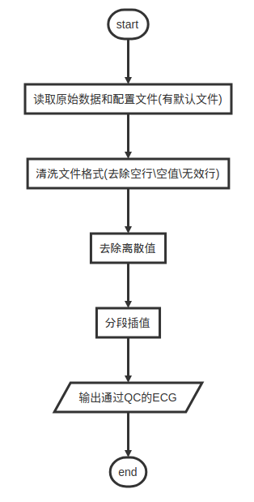
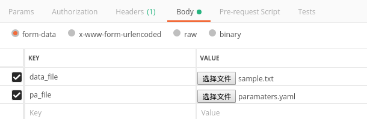
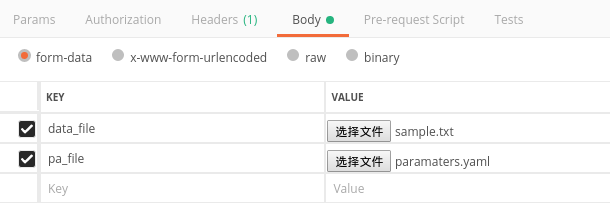
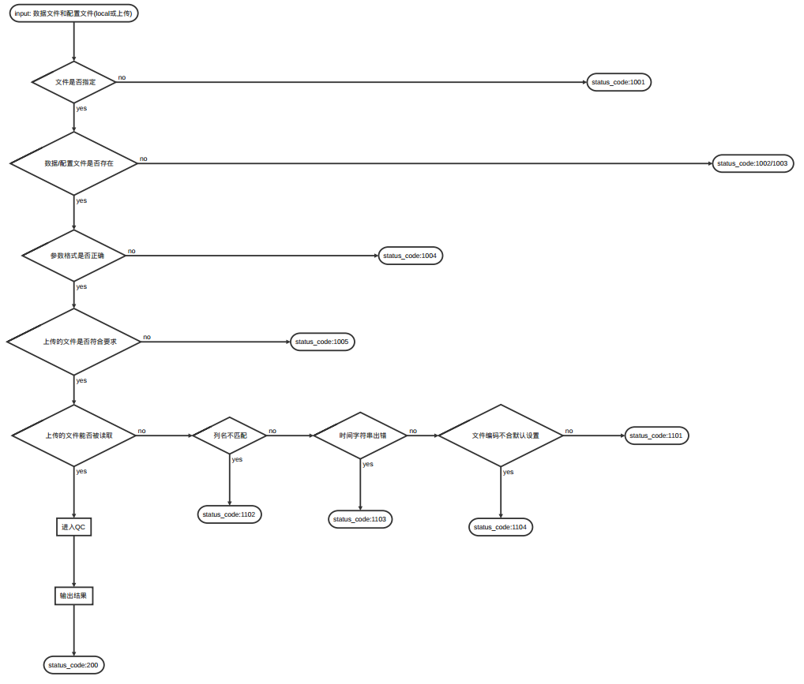

# 血糖数据

> 数据文件的格式依据Abbott 血糖仪，整理处理流程

[TOC]

## 1. 流程/IO

### 1.1 流程

1. 从文件读取原始数据
2. 文件编码识别(默认关闭)
3. clean原始数据
4. 生成df/ts
5. 过滤异常值
6. 插值重采样

```shell
docker下运行时间：约500ms
2018-11-27 21:02:05,053 - Timer: buildManager spent 11.3ms
2018-11-27 21:02:05,061 - Timer: read_raw spent 6.9ms
2018-11-27 21:02:05,064 - Timer: clean_raw spent 10.6ms
2018-11-27 21:02:05,191 - Timer: ts_convert spent 137.4ms
2018-11-27 21:02:05,195 - Timer: check spent 3.7ms
2018-11-27 21:02:05,308 - Timer: breaks spent 112.7ms
2018-11-27 21:02:05,332 - Timer: resample spent 136.6ms
2018-11-27 21:02:05,499 - Timer: get_resample spent 457.1ms
```

### 1.2 输入数据实例

```
ID	时间	记录类型	葡萄糖历史记录（mmol/L）	扫描的葡萄糖读数（mmol/L）	没有标注数值的速效胰岛素	速效胰岛素（单位）	没有标注数值的食物	碳水化合物（克）	没有标注数值的长效胰岛素	长效胰岛素（单位）	备注	试纸测得的葡萄糖（mmol/L）	酮（mmol/L）	不适用	不适用	不适用	以前的时间	更新后的时间
85	2018/09/10 13:50	0	5.2															
86	2018/09/10 14:05	1		5.0														
88	2018/09/10 14:05	0	4.9															
89	2018/09/10 14:20	0	5.1															
90	2018/09/10 14:35	0	5.3															
91	2018/09/10 14:50	0	5.2															
92	2018/09/10 15:05	0	4.9															
93	2018/09/10 15:20	0	4.9															
94	2018/09/10 15:35	0	5.0															
95	2018/09/10 15:50	1		5.1														
97	2018/09/10 15:51	0	5.0															
98	2018/09/10 16:06	0	5.0															
99	2018/09/10 16:21	5					1				
```

### 1.3 返回实例: 数据读取并转化为特定格式json输出

```
[
    {
        "timestamp": 1536587400000,
        "value": 5.2
    },
    {
        "timestamp": 1536587700000,
        "value": 5.2
    },
    {
        "timestamp": 1536588000000,
        "value": 5
    },
    {
        "timestamp": 1536588300000,
        "value": 5
    },
    {
        "timestamp": 1536588600000,
        "value": 5
    }
]
```

***

## 2. 质控

### 2.1 数据质控描述

	2.1.1 去除空值\无效记录行
	2.1.2 去除时间上的离散值(前后60分钟孤立点),去除血糖值上的离散值(保留范围:[均值-3*std,均值+3*std])
	2.1.3 为连续时间段的血糖分段插值

### 2.2 数据质控流程图

```flow
st=>start: start
op1=>operation: 读取原始数据和配置文件(有默认文件)
op2=>operation: 清洗文件格式(去除空行\空值\无效行)
op3=>operation: 去除离散值
op4=>operation: 分段插值
io=>inputoutput: 输出通过QC的ECG
e=>end: end
st->op1->op2->op3->op4->io->e
```



## 3 API

### 3.1 get/resample 获得全流程输出结果--插值后

api: */get/resample*

method: POST

输入：

**"device"默认值为"Abbott",**

**"detect"默认值为"False"**

```json
{
 "data_path":"sample.txt",
 "device":"Abbott",
 "detect":"False"
}
```

或者上传：(其中pa_file是可选的)



​	

输出：

```json
[
    {
        "timestamp": 1536587400000,
        "value": 5.2
    },
    {
        "timestamp": 1536587700000,
        "value": 5.2
    },
    {
        "timestamp": 1536588000000,
        "value": 5
    },
    {
        "timestamp": 1536588300000,
        "value": 5
    },
    {
        "timestamp": 1536588600000,
        "value": 5
    }
]
```

### 3.2 未插值时间序列: get/ts

api: */get/ts*

method: POST

输入：

**"device"默认值为"Abbott",**

**"detect"默认值为"False"**

```json
{
 "data_path":"sample.txt",
 "device":"Abbott",
 "detect":"False"
}
```

或者上传：(其中pa_file是可选的)


​	

输出：

```json
[
    {
        "timestamp": 1536587400000,
        "value": 5.2
    },
    {
        "timestamp": 1536587700000,
        "value": 5.2
    },
    {
        "timestamp": 1536588000000,
        "value": 5
    },
    {
        "timestamp": 1536588300000,
        "value": 5
    },
    {
        "timestamp": 1536588600000,
        "value": 5
    }
]
```


### 3.3 get/df : 获得数据帧

api: */get/df*

method: POST

输入：

"device"默认值为"Abbott",

 "detect"默认值为"False"
​    
```json
{
 "data_path":"sample.txt",
 "device":"Abbott",
 "detect":"False"
}
```

或者上传：



输出：

```json
[
    {
        "time": "Mon, 10 Sep 2018 13:50:00 GMT",
        "timestamp": 1536587400,
        "value": 5.2
    },
    {
        "time": "Mon, 10 Sep 2018 14:05:00 GMT",
        "timestamp": 1536588300,
        "value": 5
    },
    {
        "time": "Mon, 10 Sep 2018 14:05:00 GMT",
        "timestamp": 1536588300,
        "value": 4.9
    },
    {
        "time": "Mon, 10 Sep 2018 14:20:00 GMT",
        "timestamp": 1536589200,
        "value": 5.1
    }
]
```
### 3.4 查看QC参数: get/describe_qc

api: */get/describe_qc*

method: POST

输入：

**"device"默认值为"Abbott",**

**"detect"默认值为"False"**

```json
{
 "data_path":"sample.txt",
 "device":"Abbott",
 "detect":"False"
}
```

或者上传：同上


输出：

```json
{
    "data": {
        "主要参数": {
            "采样率": "300s"
        },
        "设备": "Abbott"
    },
    "message": "success",
    "status_code": 200
}
```
### 3.5 查看血糖数据信息: get/describe_glucose

api: */get/describe_glucose*

method: POST

输入：

**"device"默认值为"Abbott",**

**"detect"默认值为"False"**

```json
{
 "data_path":"sample.txt",
 "device":"Abbott",
 "detect":"False"
}
```

或者上传：同上


输出：

```json
{
    "data": {
        "原始数据维度": [
            3211,
            19
        ],
        "数据源文件地址": "<FileStorage: 'sample.txt' ('text/plain')>",
        "设备": "Abbott",
        "读出的数据帧的列名": "time,timestamp,value",
        "读出的数据帧的维度": [
            3194,
            3
        ],
        "读出的时间序列起止时间": [
            "Mon, 10 Sep 2018 13:50:00 GMT",
            "Mon, 08 Oct 2018 18:59:00 GMT"
        ],
        "读出的时间序列长度": 3160,
        "连续时间列表": [
            [
                "2018-09-10 13:50:00",
                "2018-09-11 19:27:00"
            ],
            [
                "2018-09-11 20:28:00",
                "2018-09-12 20:33:00"
            ],
            [
                "2018-09-12 22:19:00",
                "2018-09-13 11:37:00"
            ],
            [
                "2018-09-13 12:52:00",
                "2018-09-24 12:27:00"
            ],
            [
                "2018-09-24 20:06:00",
                "2018-10-05 23:21:00"
            ],
            [
                "2018-10-06 00:40:00",
                "2018-10-08 18:59:00"
            ]
        ],
        "连续时间段数": 6
    },
    "message": "success",
    "status_code": 200
}
```

## 4. 错误处理

### 4.1 错误码

| code |                   message                   |        describe        | HTTP code |
| :--: | :-----------------------------------------: | :--------------------: | :-------: |
| 200  |                   success                   |          成功          |    200    |
| 1001 |         Data file is not specified          |     数据文件未指定     |    400    |
| 1002 |          Data file path not found           |     数据文件不存在     |    400    |
| 1003 |        Parameter file path not found        |     参数文件不存在     |    400    |
| 1004 | Data and Parameter file path must be string |      参数类型错误      |    400    |
| 1005 |              Upload Data error              |    上传的文件不正确    |    400    |
| 1101 |          Reading data file failed           |    读取数据文件失败    |    500    |
| 1102 |          columns can't be matched           |   数据文件列名不匹配   |    500    |
| 1103 |          prase time string failed           | 有不能解析的时间字符串 |    500    |
| 1006 |        Can't detect encoding of text        |   不能识别文件的编码   |    400    |

### 4.2 错误输出示例：

> 包含：
>
> json数据: {"message": "Data file is not specified", "status_code": 1001, "data": null}
>
> 状态码(标准)和修改的状态信息:  400 Data file is not specified

**curl**

    ```
    *   Trying 127.0.0.1...
    * TCP_NODELAY set
    * Connected to 127.0.0.1 (127.0.0.1) port 7777 (#0)
    > POST /get/ts_resample HTTP/1.1
    > Host: 127.0.0.1:7777
    > User-Agent: curl/7.58.0
    > Accept: */*
    > Content-Type: application/json
    > Content-Length: 2
    > 
    * upload completely sent off: 2 out of 2 bytes
    * HTTP 1.0, assume close after body
    < HTTP/1.0 400 Data file is not specified
    < Content-Type: application/json
    < Content-Length: 40
    < Server: Werkzeug/0.14.1 Python/3.6.4
    < Date: Tue, 27 Nov 2018 08:47:33 GMT
    < 
    * Closing connection 0
    {
        "message": "Data file is not specified",
        "status_code": 1001,
        "data": null
    }
    ```

**python:**

> input:
> ```python
> import requests
> 
> url = "http://127.0.0.1:7777/get/ts_resample"
> data = {}
> res = requests.post(url,json=data)
> print(res.status_code)
> print(res.content)
> ```
>
> output:
>
> ```shell
> 400
> b'{"message": "Data file is not specified", "status_code": 1001, "data": null}'
> ```

### 4.3 排错流程

```flow
st=>start: input: 数据文件和配置文件(local或上传)
op1=>condition: 文件是否指定
e1=>end: status_code:1001
op2=>condition: 数据/配置文件是否存在
e2=>end: status_code:1002/1003
op3=>condition: 参数格式是否正确
e3=>end: status_code:1004
op4=>condition: 上传的文件是否符合要求
e4=>end: status_code:1005
op5=>condition: 上传的文件能否被读取
op52=>condition: 列名不匹配
op53=>condition: 时间字符串出错
op54=>condition: 文件编码不合默认设置
e51=>end: status_code:1101
e52=>end: status_code:1102
e53=>end: status_code:1103
e54=>end: status_code:1104
op6=>operation: 进入QC
io=>operation: 输出结果
e=>end: status_code:200
st->op1
op1(yes)->op2(yes)->op3(yes)->op4(yes)->op5(yes)->op6->io->e
op1(no)->e1
op2(no)->e2
op3(no)->e3
op4(no)->e4
op5(no)->op52(yes)->e52
op52(no)->op53(yes)->e53
op53(no)->op54(yes)->e54
op54(no)->e51
```




