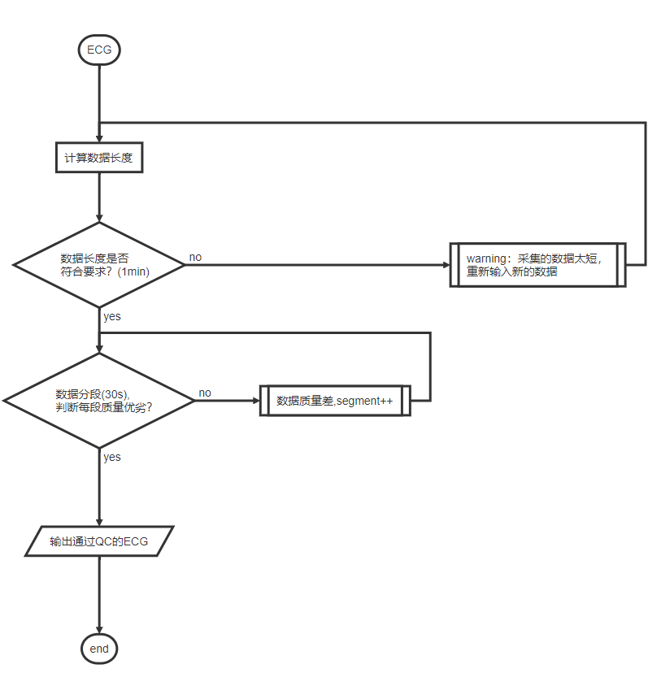

## 心电数据

> 依据心卫士心电数据，整理处理流程

### 1. 读取数据

##### 1.1 数据实例

```
"1513048920000	92.56"
"1513048920004	92.56"
"1513048920008	92.56"
"1513048920012	92.56"
"1513048920016	91.34"
```

##### 1.2 数据读取并转化为特定格式

```
                time     ecg
0      1513048920000   92.56
1      1513048920004   92.56
2      1513048920008   92.56
3      1513048920012   92.56
```

***

### 2. 质控

##### 2.1 数据质控描述

	2.1.1 数据长度最短长度：1min(60*fs)。
	2.1.2 信号的基线漂移变化(阈值-1.5mean_base~3.5mean_base)、幅值变化(阈值设为-2mean_ecg~4mean_ecg)、噪声信号能量比(<0.3)

##### 2.2 数据质控流程图

```flow
st=>start: ECG
op=>operation: 计算数据长度
cond1=>condition: 数据长度是否
符合要求？(1min)
cond2=>condition: 数据分段(30s),
判断每段质量优劣？
sub1=>subroutine: warning：采集的数据太短，
重新输入新的数据
sub2=>subroutine: 数据质量差,segment++
io=>inputoutput: 输出通过QC的ECG
e=>end: end
st->op->cond1->cond2
cond1(yes)->cond2(yes)->io->e
cond1(no)->sub1(right)->op
cond2(no)->sub2(right)->cond2
```



***

### 3. 数据特征

##### 3.1 数据处理描述

	3.1.1 巴特沃斯带通滤波器去ECG高频噪声、基线漂移；
	
	3.1.2 去皂后的信号进行(0,1)归一化处理；
	
	3.1.3 归一化的ECG进行特征点定位(Pan_Tompkins、加窗阈值法等)目前用到的是加窗阈值法，得到HRV信号；
	
	3.1.4 基于HRV计算其时、频、非线性特征。

##### 3.2 数据处理流程图

```flow
st=>start: input: ECG
op1=>operation: 预处理(巴特沃斯帯通去噪去
基线漂移、数据(0,1)归一化)
op2=>operation: 特征提取(QRS)
op3=>operation: hrv信号
op4=>operation: 特征计算(时域、频域、非线性特征)
io=>inputoutput: 输出通过特征矩阵
e=>end: end
st->op1->op2->op3->op4->io->e
```


