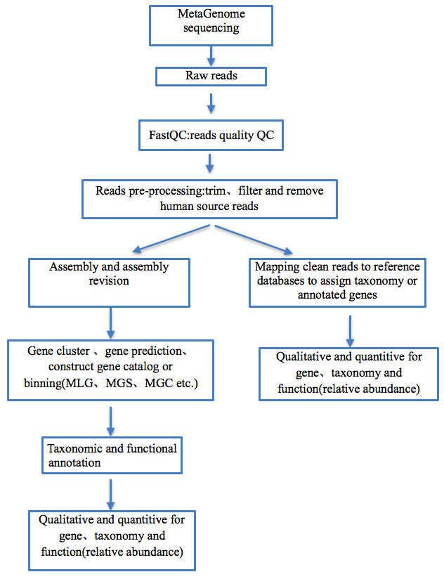
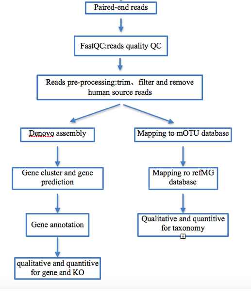

# Metagenome pipeline

### 背景介绍：

基于 ILLUMINA测序的环境微生物宏基因组数据,鉴定出基因、物种和功能等的类别及其含量。本文档定义检测内容、输入数据与格式、输出数据与格式，通用的和 目前我们使用的分析方法及其评价。

### 检测内容：

样本中的基因、功能和微生物种类及其含量，检测方法涉及与已知参考序列的比对、组装、基因预测与基因功能注释等。

### 输入数据及格式：

输入metagenome 二代测序下机原始数据,数据格式均为 Fastq 格式.

### 输出数据及格式：

按照从样本库和知识库的分工，样本库存储纯检测信息，不包含知识关联的信息,故检测结果的存储格式参考 VCF 格式进行设计。

从检测角度讲，检测输出应该包含：检测对象、检测质量、检测细节、检测结果、检测工具/方法和检测结果来源：

1. 检测对象：一般包含原始检测对象编号(origID)，原始检测名(origName)，碳云检测本体编号(ICX)。其中获得原始检测对象编号——碳云检测本体编号，或者原始检测名称——碳云检测本体编号的映射关系。宏基因组的物种检测结果用NCBI ID或其他公共数据库 ID，微生物名称，taxonomy 来定义微生物对象;基因检测结果用 eggNOG ID、IGC ID、原始检测基因 ID 来定义基因对象;功能检测结果用KEGG中ID来定义。

2. 检测质量: 此处展示该检测的质量整体评估,比如对序列注释过程中由比对算法计算来的score值等。

3. 检测细节：此处包含检测获得的各种细节信息(Inf)。原则上，
   通过这些信息和相应的分析标准，可以重新获得检测质量和
   检测结果的内容。此处信息要求完整、客观，为后期提升检
   测判定水平的奠定基础。

4. 检测结果(Result)：此处包含检测的核心结果。如基因、微生物和功能的种类及其丰度等指标。

5. 检测工具/方法(Method)：如 MOCAT2、metaphlan2 等。

6. 检测结果来源(Source)：如 novogene, lane, library, platform,date 等信息。

检测输出以样本进行组织，原始输出为文件形式，格式为Quantitive detection format v0.1。另外，Method 和 Source 包含在注释信息种中。微生物对象由名称，taxonomy和function由检测数据库 ID 界定。基因对象由注释数据库 ID 界定。

### 分析功能:

#### 目前通用的宏基因组分析流程

#### 目前碳云使用的基于MOCAT2 分析流程

更多信息可访问：10.1371/journal.pone.0047656 和 http://mocat.embl.de/.

本分析流程以 MOCAT2 现有流程为核心，再此基础上对分析环节进行挑选、调整与定制。如上图所示本流程主要包含如下分析环节：

1. 数据预处理：
   该步骤对原始数据进行 trim 、filter并去除宿主序列，即对质量不满足要求的碱基进行修剪过滤,长度不达标和宿主来源的reads剔除等。此处 使 用 免 费 的 fastq_quality_filter ， fastq_quality_trimmer 和fastx_quality_stats,这些程序一般来自于 fastx_toolkit。通过与 hg19 序列比对，去除能够比对上的 reads（称为 screen),此处采用SOAPalign2 实现。分析结果保存为 soap 格式，相应统计数据加入 read 质控表。
2. mOTU 比对：
   将上述 screen 之后的 reads 比对到 mOTU(consisting of 10 MGs representing 3,445 prokaryotic reference genomes and unknown species reconstructed from 263 publicly available metagenomes)，该库包含 44733 条序列，且每条序列与 COG 数据库相关联,能够比对上的 reads 被认为是微生物的测序数据，被输出供后续使用。
3. mOTU 比对过滤：
   比对上 mOTU 序列的 reads，将根据其比对情况，从 coverage和 length 角度进行过滤。筛选出能够高质量比对上的 reads，这些数据被用于确定检测到的微生物，定位到 COG 的分类系统的微生物,并且计算相应微生物物种的相对丰度。       
4. RefMG 比对：
   将 mOTU 比对上的 reads 进一步比对到 RefMG（contains MGs only from NCBI reference genomes),进一步筛选后，能够获得能够定到 NCBI 分类系统的微生物,从而获得 taxonomy 结果。这些结果以物种的 taxaid 编号进行界定，通过知识库与知识网络对接。
5. De novo组装与基因预测、去冗余:
   将预处理去宿主之后的clean reads使用sopedenovo进行组装,选择组装产生的长度大于500bp的scaftig序列,用MetaGeneMark进行基因预测,然后用cd-hit-est对预测到的基因聚类.得到新构建的非冗余的基因集.
6. 基因集注释、计算丰度:
   将预处理产生的clean reads与构建的基因集比对,结合比对结果和基因的长度信息计算基因的相对丰度(RPKM);通过基因集与已知数据库(整合华大发布的IGC基因集和其他科研项目的数据,去冗余所构建的15M基因集)比对,结合IGC的注释信息得到新构建基因的注释信息,计算KO的RPKM文件(后续15M基因集注释完成之后,即可用于taxonomy、function等的profiling).

### 检测效果测评

##### 测评目标：

	微生物宏基因组分析工具及流程很多并且没有统一的标准,通过测评,可以判断目前使用的分析流程对物种检测的敏感性和特异性,以及消耗的资源等,为后续流程的优化迭代做参考依据.

##### 测评数据：

	查找相关文献以及科研机构发布的benchmark dataset,待更新...	

##### 测评结果：

	结合近两年对微生物宏基因组使用工具以及算法流程的对比结果,整合测评指标以及指标的计算,待更新...

##### 测评结论：

	待更新...
