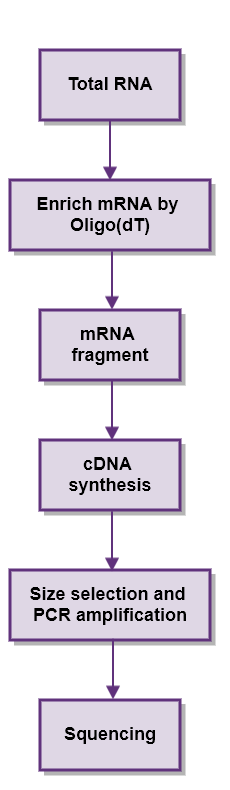
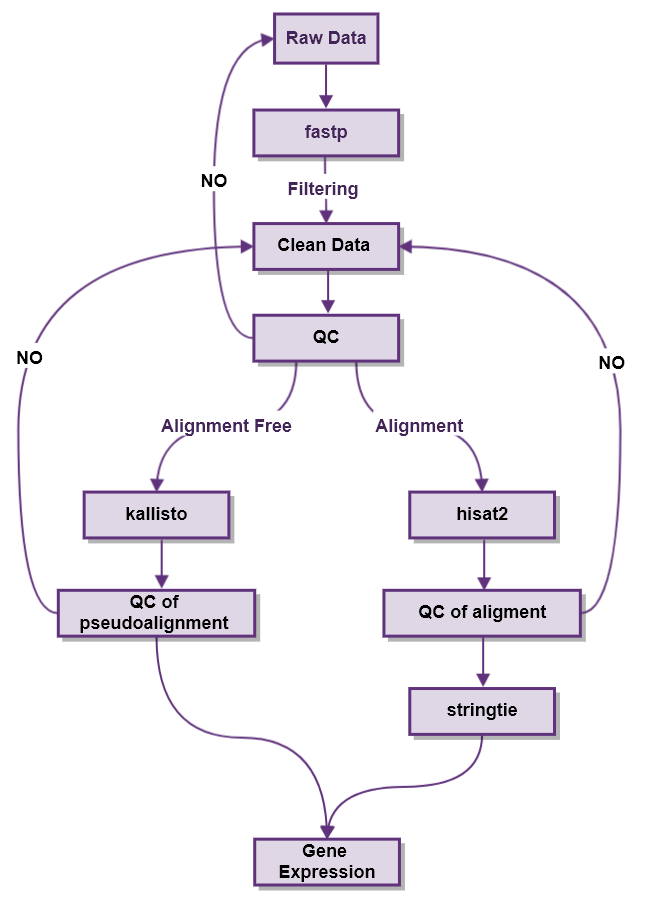

[TOC]
# **RNA-SEQ分析方法**

## **1 RNA-SEQ技术简介**

RNA-SEQ是用来研究某一生物对象在特定生物学过程中基因表达情况的技术[1，2],。该技术结合了转录组建库实验方法与数字基因表达谱的信息分析手段，可获得表达的基因的种类及表达量。基于此信息，后续可进行基因表达量分析、基因表达差异分析等，可广泛应用于生理调控、临床医学研究、环境改造等领域。

## **2 RNA-SEQ技术优势如下：**

1. 高、低表达基因均可鉴定
2. 定量准确，可重复性也比较好
3. 可鉴别序列中单个碱基的差异
4. 分析结果可随数据库更新而随时更新
5. 可用于检测融合基因、RNA变异、可变剪切等

## **3 实验简介**

图1. RNA-Seq实验流程图

## **4 RNA-SEQ实验步骤:**

1. 提取样品总RNA并使用DNaseI消化。
2. 用带有Oligo（dT）的磁珠富集真核生物mRNA。
3. 向得到的mRNA中加入适量打断试剂高温条件下使其片断化。
4. 再以片断后的mRNA为模板，合成cDNA，经过磁珠纯化、末端修复、3&#39;末端加碱基 A、加测序接头后。
5. 进行PCR扩增，从而完成整个文库制备工作。构建好的文库用Agilent 2100 Bioanalyzer和ABI StepOne Plus RealTime PCR System进行质量和产量检测。
6. 文库质控合格后进行测序。

## **5 信息分析简介**

由测序所得的数据称为raw reads或raw data，随后要对raw reads进行质控(QC)，以确定测序数据是否适用于后续分析。 质控后，经过滤得到的clean reads比对到参考序列。比对完，通过统计比对率、reads在参考序列上的分布情况等，判断比对结果是否通过第二次质控(QC of alignment)。若通过，则进行后续的基因定量分析信息分析。

## 6 **质控（QC）标准**

### 6.1 质控标准适用范围

本文档定义的质控的标准适用于表一中的适用范围。

| RNA-SEQ测序类型 | RNA-SEQ |
| --- | --- |
| 测序平台 | Illumina |
| 测序类型 | 双端（Paired-end，PE）测序 |
| 测序读长 | 150bp、100bp |
| 分析流程 | 碳云RNA-SEQ测序分析流程v1.0.6 |
                        

### 6.2 质控指标及合理范围

测序公司提供的测序数据包括原始数据和过滤后的数据。RNA-SEQ分析流程适用过滤后的数据作为输入数据进行分析。分析步骤主要包括过滤后数据统计、比对及定量。

| 质控指标 | 指标描述 | 合理值范围 | 是否为强制指标 |
| --- | --- | --- | --- |
| Raw total reads | 输入的read数量 | >=410M(100bp) or >=300M(150bp) | 否 |
| Raw total bases(G) | 输入的碱基量 | >=8G | 是 |
| Raw GC(%) | GC含量 | 40-50% | 否 |
|  Raw Q20 | 测序质量值大于等于20碱基的比例 |  >=90% |  否 |
|  Raw Q30 | 测序质量值大于等于30碱基的比例 |  >=85% |  是 |
| Raw read mapped rate(%) | 输入数据中，比对到参考序列的read比例 |  >=70% |  是 |

表2：数据质控指标及其合理范围[1,3]

## 7 **输入于输出文件格式介绍**
### 7.1 **输入文件**

流程输入数据格式均为Fastq格式，且为Pair-End测序，每个样品提供成对文件，若同一个样品有2对及以上的文件，应合并为一对文件再作为输入文件。

### 7.2 **输出文件**

流程输出数据格式均为AQDF文件格式，AQDF文件中信息应该尽可能包括样品信息、检测对象、检测细节、检测工具/方法和检测结果信息。

AQDF文件格式信息如下：

1. 样品信息：一般包括原始样品ID、样品类型、样品收集时间、测序类型、数据下机时间、数据开始分析时间等。
2. 检测对象：一般包含原始检测对象编号(origID)，原始检测名称(origName)，碳云检测本体编号(ICX)。其中获得原始检测对象编号——碳云检测本体编号，或者原始检测名称——碳云检测本体编号的映射关系，属于ontology mapping，是检测流程需要完成的首要任务
3. 检测细节：此处包含检测获得的各种细节信息(Inf)。原则上，通过这些信息和相应的分析标准，可以重新获得检测质量和检测结果的内容。此处信息要求完整、客观，为后期提升检测判定水平的奠定基础。
4. 检测工具/方法：检测过程中使用软件版本信息及参数信息等。
5. 检测结果：此处包含检测的核心结果，如基因定量信息（TPM值，基因长度，counts数）等。

## **8 生息分析流程说明：**

### **8.1 测序数据存储**

测序得到的原始图像数据经base calling转化为序列数据，我们称之为raw data或raw reads，结果以FASTQ[4]文件格式存储。

### **8.2 原始数据过滤**

由于原始测序数据可能包含低质量序列、接头序列等，为了保证信息分析结果的可靠性，我们需要经过一系列数据处理来过滤这些杂质raw reads，从而得到clean reads，仍然以FASTQ格式存储(该序列文件可直接用于发表，公共数据库提交等，后续分析都基于此文件)。

数据过滤的具体步骤如下:

1. 1)去除含adapter的reads；
2. 2)去除含N（表示无法确定碱基信息）比例大于10%的reads；
3. 3)去除低质量reads (质量值Q≤5的碱基数占整条read的50％以上)。

用`fastp`软件对Raw data数据按照上述3点过滤并统计QC，满足Q30大于等于85%，数据量大于等于8G即满足后续数据分析要求。

`fastp `是一款对二代测序进行质控的工具，集质控、去除接头、质量过滤、输出质控报告等等功能于一身，使用C++开发，支持多线程，速度极快。改软件可以输入JSON格式的质控报告，方便加入自动化流程。  
其特点如下：

1. 对数据自动进行全方位质控，生成人性化的报告；
2. 过滤功能(低质量,太短,太多N......)；
3. 对每一个序列的头部或尾部，计算滑动窗内的质量均值，并将均值较低的子序列进行切除(类似 Trimmomatic 的做法,但是快非常多)；
4. 全局剪裁 (在头/尾部，不影响去重)，对于 Illumina 下机数据往往最后一到两个 cycle 需要这样处理；
5. 去除接头污染。厉害的是，你不用输入接头序列，因为算法会自动识别接头序列并进行剪裁；
6. 对于双端测序(PE)的数据，软件会自动查找每一对read的重叠区域，并对该重叠区域中不匹配的碱基对进行校正；
7. 去除尾部的 polyG。对于NextSeq/NovaSeq 的测序数据，因为是两色法发光，polyG 是常有的事，所以该特性对该两类测序平台默认打开；
8. 对于PE数据中的overlap区间中不一致的碱基对，依据质量值进行校正；
9. 可以对带分子标签(UMI)的数据进行预处理，不管UMI在插入片段还是在index 上，都可以轻松处理；
10. 可以将输出进行分拆，而且支持两种模式，分别是指定分拆的个数，或者分拆后每个文件的行数。

### **8.3 基因定量分析**

基因定量分析是鉴定样品中基因表达情况一种分析方法，用TPM表示，数值越大，表示基因表达量越高，越低则表达量越低。TPM又称为 Transcripts per million reads，计算方法是基因区域reads总数除以基因长度，再除以样本所有基因区域reads总数，得到数字即为`TPM`。

目前主流的RNA SEQ定量方法主要有两种：比对流程（Alignment）和假比对流程（Alignment Free）

两种流程的优缺点比较：

**比对流程：**

1. 优点：产生的bam文件可以用于其他项目分析，可以发现新的转录本。
2. 缺点： 速度相对较慢，定量准确性相对低

**假比对流程：**

1. 优点：速度更快，定量更准确（基于benchmark和自身评测）6,7。
2. 缺点：无法发现新的转录本（算法导致）8。

**为了满足不同的需要，构建了两套流程。**

 

图2 RNA SEQ定量分析流程图

#### **8.3.1 比多流程**

为了测序数据二次质控，需要把reads比对到参考基因组，一般情况，比对率越高，表明测序的样本与参考物种的亲缘关系越近。比对率低可能由于测序样品同参考物种相似度低，或者有其他污染造成，则可以根据比对率来判断测序数据质量，同时也是为了基因定量分析，也需要把reads比对到参考基因组，以便后续分析。

`hisat2`[9]是一种把二代测序reads比对到人类基因组的快速且灵敏的比对程序，该程序基于BWT的图形扩展，设计并实现了图形化FM索引，这是一种原创的方法，并且据我们所知最早的实现。除了使用人类基因组全局GFM索引之外，hisat2使用了大量小GFM索引，而这些索引能够完全覆盖整个基因组，而这样小的索引代表56Kbp的基因组区域，人类基因大概有55000个这样索引。这些小索引又称为本地索引，再结合多种策略，可以实现reads快速且准确比对，这种新的索引方法被称为HGFM（Hierarchical Graph FM index）。

就速度而言，`hisat2`比STAR和`TopHat2`平均快上2.5~100倍。但`hisat2`找到junction正确率最高，但是在总数上却比`TopHat`和`STAR`少。我们使用比对软件`hisat2`将clean data比对到参考基因组，`hisat2`是`Tophat2/Bowtie2`的继任者，使用改进的BWT算法，实现了更快的速度和更少的资源占用。比对结果文件为bam文件，根据bam文件统计比对率，一般与参考基因组比对率在70%-90%之间。

`stringTie`由约翰霍普金斯大学联合德州大学西南医学中心开发，能够组装转录本并预计表达水平。它应用网络流算法和可选的denovo组装，将复杂的数据集组装成转录本。相对于其他拼接软件（`Cufflinks, IsoLasso, Scripture，Traph`等），`stringtie`能够拼接出更完整、更准确的基因，并且StringTie采用拼接和定量同步进行，相对于其他方法，其定量结果更加准确。用StringTie工具根据hisat2比对结果和GTF文件进行基因表达定量，同时还可以预测新转绿本本并计算新转录组的表达量。

#### **8.4.2 假比多流程**

kallisto[8]是一个用于对转录组或者单细胞转录组进行定量的程序。它基于假比对的新算法，该算法结合k-mer和transcriptome de Bruijn graph两种算法，主要聚焦于识别reads可能源自的转录本，而不试图精确地指出reads比多到参考基因组上的具体位置， reads在转录本上的精确的位置对于基于counts的转录本定量是非必需的，因此这种方法可以快速确定reads，属于哪一个转录本而不需要比对。

在使用标准RNA-Seq数据进行基准测试的情况下，kallisto仅需要reads组索引(索引本身需要不到10分钟构建)，就可以在3分钟内在Mac台式电脑上量化3000万次人类读取。假比对保留reads量化所需的关键信息，因此kallisto不仅速度快，而且与现有的量化工具一样准确。事实上，由于假比对过程对reads的自身的质量（reads 质量值低一些也没关系）更加包容，在许多基准测试中，kallisto的性能显著优于现有的工具[6,7]。

## **参考文献**

1 Mortazavi, A., Williams, B. A., McCue, K., Schaeffer, L. &amp; Wold, B. Mapping and quantifying mammalian transcriptomes by RNA-Seq. _Nat Methods_ **5** , 621-628, doi:10.1038/nmeth.1226 (2008).

2 Wang, Z., Gerstein, M. &amp; Snyder, M. RNA-Seq: a revolutionary tool for transcriptomics. _Nat Rev Genet_ **10** , 57-63, doi:10.1038/nrg2484 (2009).

3 Conesa, A. _et al._ Erratum to: A survey of best practices for RNA-seq data analysis. _Genome Biol_ **17** , 181, doi:10.1186/s13059-016-1047-4 (2016).

4 Cock, P. J., Fields, C. J., Goto, N., Heuer, M. L. &amp; Rice, P. M. The Sanger FASTQ file format for sequences with quality scores, and the Solexa/Illumina FASTQ variants. _Nucleic Acids Res_ **38** , 1767-1771, doi:10.1093/nar/gkp1137 (2010).

5 Chen, S., Zhou, Y., Chen, Y. &amp; Gu, J. fastp: an ultra-fast all-in-one FASTQ preprocessor. _Bioinformatics_ **34** , i884-i890, doi:10.1093/bioinformatics/bty560 (2018).

6 Sahraeian, S. M. E. _et al._ Gaining comprehensive biological insight into the transcriptome by performing a broad-spectrum RNA-seq analysis. _Nat Commun_ **8** , 59, doi:10.1038/s41467-017-00050-4 (2017).

7 Everaert, C. _et al._ Benchmarking of RNA-sequencing analysis workflows using whole-transcriptome RT-qPCR expression data. _Sci Rep_ **7** , 1559, doi:10.1038/s41598-017-01617-3 (2017).

8 Bray, N. L., Pimentel, H., Melsted, P. &amp; Pachter, L. Near-optimal probabilistic RNA-seq quantification. _Nat Biotechnol_ **34** , 525-527, doi:10.1038/nbt.3519 (2016).

9 Kim, D., Langmead, B. &amp; Salzberg, S. L. HISAT: a fast spliced aligner with low memory requirements. _Nat Methods_ **12** , 357-360, doi:10.1038/nmeth.3317 (2015).

10 Pertea, M. _et al._ StringTie enables improved reconstruction of a transcriptome from RNA-seq reads. _Nat Biotechnol_ **33** , 290-295, doi:10.1038/nbt.3122 (2015).