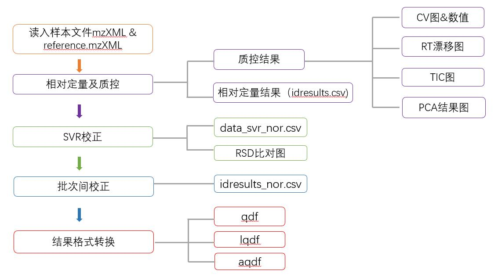

[toc]
## 代谢分析流程
version: 1.0
author: 龙巧云

### 1. 术语（Glossary)
1. 代谢组(metabolome)：指生物体内代谢物质的动态整体。通常所指的代谢组只涉及相对分子质量约小于1000的小分子代谢物质。

2. LC-MS/MS: 液相色谱-串联质谱（tandem MS)，蛋白质组和代谢组常用的检测方法。LC指高效液相色谱（High Performance Mass Spectrometry)，用于分离；分离后的代谢物经过ESI电离后，在质量检测器（mass detector)，生成质谱图（Mass Spectrum)，质谱图是由m/z和rt组成的二维矩阵。

3. 质荷比（m/z）：带电离子的质量与所带电荷之比值, 是该离子的物理特性，为一定值。受仪器分辨率的限制，检测出的mz会有波动，该波动为质谱仪的分辨率（resolution)。

4. 保留时间（Retention Time，RT）：被分离样品组分从进样开始到柱后出现该组分浓度极大值时的时间，也即从进样开始到出现某组分色谱峰的顶点时为止所经历的时间。对于特定的分离柱，组分（分子离子）的保留时间与其物理化学性质有关。

5. 母离子/前体离子(precursor)：代谢物经ESI电离后形成的带电粒子。

6. 一级谱图（MS): 在某一保留时间，多个代谢物经ESI电离后形成的多个母离子，被质量检测器检测后，得到的m/z和rt二维矩阵。

7. 二级质谱（MS2）: 一级谱图中的某一母离子进行高能碎裂后，得到的多个碎片离子，被质量检测器检测后，得到的m/z和rt二维矩阵，称为MS2.

8. 分子离子峰（peaks）:某一样品中的分子离子峰，表示某一质荷比的粒子出现的区域，以[mzmin, mzmax, rtmin, rtmax]表示。

9. 特征（features）: 与peaks有相同的表示形式[mzmin, mzmax, rtmin, rtmax]。与peaks不同的是，features可代表该分子离子（peaks是该分子离子的一部分，一个分子离子可有多个peaks)。features可由一个样本的多个peaks合并而来，也可由多个样本的多个peaks合并而来。

### 2. 分析流程
   分析流程为自主开发的流程
   
#### 2.1 实验室质控
    由观澜平台负责
    
#### 2.2 流程图

> 代谢分析流程。由原始数据下机到生成最终的aqdf，中间要经历定量、定量后质控、批次间校正、格式转换四个过程。

1. reference样本是在整个检测周期（所有批次）中固定的样本，通常是固定的QC。

2. 原始数据下机后，转换成mzxml格式，之后根据reference样本做时间轴校正，保证保留时间的可比性。

3. 在经过时间轴校正的样本上，做相对定量。该步骤包含峰提取、峰合并、峰鉴定三步。其中峰提取和峰合并的目的是定位某一个母离子出现的区域，结果以[mzmin,mzmax,rtmin,rtmax]表示。峰鉴定是根据该母离子对应的MS2, 与标准化合物的MS2数据库（需购买）比对后，判断该峰属于哪一个代谢物。**该步骤可用xcms或者自己开发的流程**

4. 定量后质控。样本通常是以批次形式存在的，一批次样本包含多个样本和QC，定量后质控是从数据的角度判断该批次的检测情况，包含该批次的CV（理论上应该比较稳定的features的CV), RT漂移（RT漂移太大可能是样本或者分离柱的问题）、TIC、PCA等。

5. 批次间校正。包括SVR和reference校正两部分。SVR校正根据该批次QC样本的变化趋势，对样本的Features进行校正，reference样本参与校正。reference校正是指将SVR校正后的结果，根据reference样本进行比值校正，保证reference样本在各批次间的一致性。

6. 格式转换。ID转换，用于产品。

